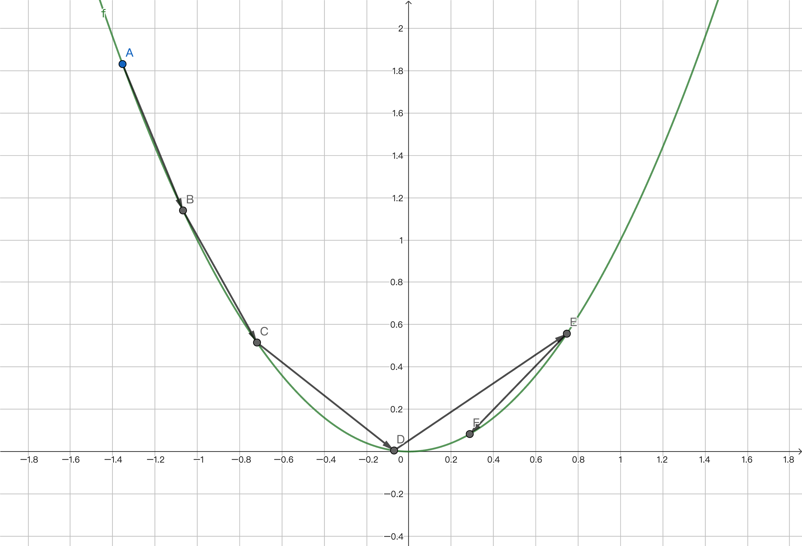

# 现代编程思想

## 案例：基于梯度下降的神经网络

### Hongbo Zhang

# 案例：鸢尾花

- 鸢尾花数据集是机器学习中的"Hello World"
	- 1936年发布
	- 包含对3种鸢尾花的测量，各有50个样本
	- 每个样本包含4项特征：花萼与花瓣的长度和宽度
- 目标
	- 通过特征，判断属于哪一类鸢尾花
	- 构建并训练神经网络，正确率95%以上

# 神经网络

<div class="columns">
<div>

- 神经网络是机器学习的一种
	- 模拟人的大脑神经结构
	- 单个神经元通常有
		- 多个输入
		- 一个输出
	- 神经元在达到一定阈值后激活
	- 通常分为多层结构

</div>
<div>


</div>
</div>

# 神经网络
<div class="columns">
<div>

- 一个典型的神经网络通常包含
	- 输入层：接受输入的参数
	- 输出层：输出计算结果
	- 隐含层：输入层与输出层之间的层级
- 神经网络的架构
	- 隐含层的层数、节点数、连接方式
	- 神经元的激活函数等

</div>
<div>


</div>
</div>

# 神经网络架构
<div class="columns">
<div>

- 输入：每个样本包含4个特征，四个输入
- 输出：属于每一种类的可能性，三个输出
- 样本数：150（总共）
- 网络架构：前馈神经网络
	- 输入层：四个节点
	- 输出层：三个节点
	- 隐含层：一层四个节点
	- 全连接：每一个神经元与前一层所有神经元相连

</div>
<div>


</div>
</div>

# 神经元
<div class="columns">
<div>

- $f = w_0 x_0 + w_1 x_1 + \cdots + w_n x_n + c$
	- $w_i$, $c$：参数
	- $x_i$：输入
- 激活函数
	- 隐含层：线性整流函数 ReLU
		- 当计算值小于零，不激活神经元
		- $f(x) = \begin{cases}x & \text{x >= 0} \\0 & \text{x < 0}\end{cases}$
	- 输出层：Softmax
		- 将输出整理为总和为1的概率分布
	  - $f(x_m) = \frac{e^{x_m}}{\sum\limits_{i=1}^N e^{x_i}}$

</div>
<div>


</div>
</div>

# 神经网络实现
- 运算的定义
	```moonbit
	trait Base {
	  constant(Double) -> Self
	  value(Self) -> Double
	  op_add(Self, Self) -> Self
	  op_neg(Self) -> Self
	  op_mul(Self, Self) -> Self
	  op_div(Self, Self) -> Self
	  exp(Self) -> Self // 用于计算softmax
	}
	```

# 神经网络实现
- 激活函数
	```moonbit
	fn reLU[T : Base](t : T) -> T {
	  if t.value() < 0.0 { T::constant(0.0) } else { t }
	}

	fn softmax[T : Base](inputs : Array[T]) -> Array[T] {
	  let n = inputs.length()
	  let outputs : Array[T] = Array::make(n, T::constant(0.0))
	  let mut sum = T::constant(0.0)
	  for i = 0; i < n; i = i + 1 {
	    sum = sum + inputs[i].exp()
	  }
	  for i = 0; i < n; i = i + 1 {
	    outputs[i] = inputs[i].exp() / sum
	  }
	  outputs
	}
	```
# 神经网络实现

- 输入->隐含层
	```moonbit
	fn input2hidden[T : Base](inputs: Array[Double], param: Array[Array[T]]) -> Array[T] {
	  let outputs : Array[T] = Array::make(param.length(), T::constant(0.0))
	  for output = 0; output < param.length(); output = output + 1 { // 4 outputs
	    for input = 0; input < inputs.length(); input = input + 1 { // 4 inputs
	      outputs[output] = outputs[output] + T::constant(inputs[input]) * param[output][input]
	    }
	    outputs[output] = outputs[output] + param[output][inputs.length()] |> reLU // constant
	  }
	  outputs
	}
	```

# 神经网络实现

- 隐含层->输出
	```moonbit
	fn hidden2output[T : Base](inputs: Array[T], param: Array[Array[T]]) -> Array[T] {
	  let outputs : Array[T] = Array::make(param.length(), T::constant(0.0))
	  for output = 0; output < param.length(); output = output + 1 { // 3 outputs
	    for input = 0; input < inputs.length(); input = input + 1 { // 4 inputs
	      outputs[output] = outputs[output] + inputs[input] * param[output][input]
	    }
	    outputs[output] = outputs[output] + param[output][inputs.length()] // constant
	  }
	  outputs |> softmax
	}
	```

# 神经网络训练
- 损失函数
	- 评估当前结果与预期结果之间的“差距”
	- 我们选择交叉熵
- 梯度下降
	- 梯度决定参数的调整方向
- 学习率
	- 学习率决定参数的调整幅度
	- 我们选择指数下降，逐渐逼近

# 神经网络训练
- 多分类问题交叉熵：$I(x_j) = -\text{ln}(p(x_j))$
	- $x_j$：事件；$p(x_j)$：$x_j$发生的概率
- 损失函数：基于抽象的定义
	```moonbit
	trait Log {
	  log(Self) -> Self // 用于计算交叉熵
	}
	fn cross_entropy[T : Base + Log](inputs: Array[T], expected: Int) -> Double {
	  -inputs[expected].log().value()
	}
	```

# 神经网络训练
- 后向微分：计算梯度
	- 从现有参数构建，积累微分
	```moonbit
	fn Backward::param(param: Array[Array[Double]], diff: Array[Array[Double]], 
		i: Int, j: Int) -> Backward {
	  { value: param[i][j], backward: fn { d => diff[i][j] = diff[i][j] + d} }
	}
	```
	- 计算并根据损失函数求微分
	```moonbit
	fn diff(inputs: Array[Double], expected: Int,
	   param_hidden: Array[Array[Backward]], param_output: Array[Array[Backward]]) {
	  let result = inputs
	    |> input2hidden(param_hidden)
	    |> hidden2output(param_output)
	    |> cross_entropy(expected)
	  result.backward(1.0)
	}
	```
# 神经网络训练
- 根据梯度更新参数
	```moonbit
	fn update(params: Array[Array[Double]], diff: Array[Array[Double]], step: Double) {
	  for i = 0; i < params.length(); i = i + 1 {
	    for j = 0; j < params[i].length(); j = j + 1 {
	      params[i][j] = params[i][j] - step * diff[i][j]
	    }
	  }
	}
	```

# 神经网络训练
- 学习率
	- 不合适的学习率可能导致学习成果下降，乃至无法收敛获得最佳结果
	
	- 指数衰减学习率：$f(x) = ae^{-bx}$，其中a、b为常数，x为训练次数

# 神经网络训练
- 将数据随机分成两个部分
	- 训练集：每一轮根据训练集的数据进行计算并求微分
	- 验证集：在训练结束后验证成果，避免过拟合
- 数据量较少，可以直接进行完整训练
	- 每一轮训练都使用训练集中的全部数据
	- 如果数据较多，则需要考虑分批训练

# 总结
- 本章节介绍了神经网络的基础知识
	- 神经网络的结构
	- 神经网络的训练
- 具体实现参见月兔试用环境
- 参考资料
	- [What is a neural network](https://www.ibm.com/topics/neural-networks)
